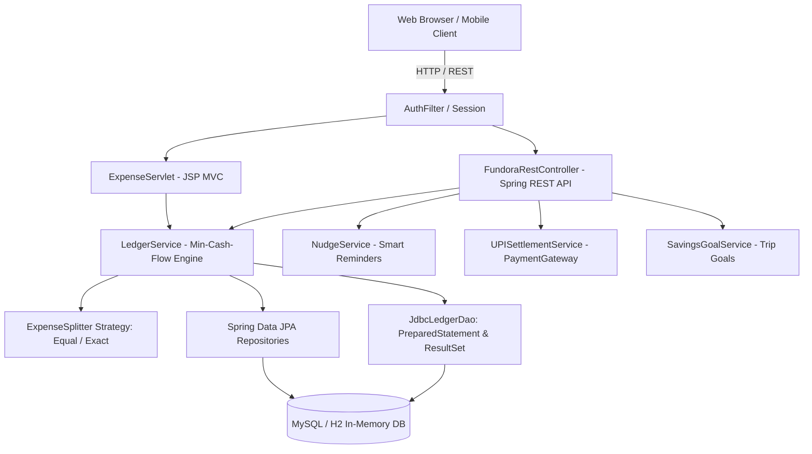

# 🚀 FUNDORA - Social FinTech Full-Stack Java Prototype

**Fundora** is a production-ready social FinTech web application for college students, flatmates, and youth circles. It unifies daily expense splitting (rent, utility bills, groceries), collaborative group savings for trips/events, transparent shared ledgers, non-intrusive smart reminder nudges, and direct UPI settlements.

This project is built to map to the **Mumbai University Full-Stack Java Programming Syllabus (Modules I to VI)**.

---

## 📚 1. Mumbai University Syllabus Mapping Matrix

| Syllabus Module | Concepts Covered | Corresponding Fundora Source Code Files |
| :--- | :--- | :--- |
| **Module I: OOP Constructs & I/O** | Custom domain classes, encapsulation, method overloading, packages (`com.fundora.*`), stream aggregations. | [`User.java`](file:///C:/Users/Dnyaneshwar/.gemini/antigravity/scratch/fundora/src/main/java/com/fundora/model/User.java), [`Group.java`](file:///C:/Users/Dnyaneshwar/.gemini/antigravity/scratch/fundora/src/main/java/com/fundora/model/Group.java), [`Expense.java`](file:///C:/Users/Dnyaneshwar/.gemini/antigravity/scratch/fundora/src/main/java/com/fundora/model/Expense.java), [`SavingsGoal.java`](file:///C:/Users/Dnyaneshwar/.gemini/antigravity/scratch/fundora/src/main/java/com/fundora/model/SavingsGoal.java) |
| **Module II: Inheritance, Interfaces & Exceptions** | Polymorphic interface design (`ExpenseSplitter`, `PaymentGatewayInterface`), custom exception hierarchy. | [`ExpenseSplitter.java`](file:///C:/Users/Dnyaneshwar/.gemini/antigravity/scratch/fundora/src/main/java/com/fundora/service/ExpenseSplitter.java), [`EqualExpenseSplitter.java`](file:///C:/Users/Dnyaneshwar/.gemini/antigravity/scratch/fundora/src/main/java/com/fundora/service/EqualExpenseSplitter.java), [`PaymentGatewayInterface.java`](file:///C:/Users/Dnyaneshwar/.gemini/antigravity/scratch/fundora/src/main/java/com/fundora/service/PaymentGatewayInterface.java), [`LedgerException.java`](file:///C:/Users/Dnyaneshwar/.gemini/antigravity/scratch/fundora/src/main/java/com/fundora/exception/LedgerException.java), [`UserNotFoundException.java`](file:///C:/Users/Dnyaneshwar/.gemini/antigravity/scratch/fundora/src/main/java/com/fundora/exception/UserNotFoundException.java), [`LedgerMismatchException.java`](file:///C:/Users/Dnyaneshwar/.gemini/antigravity/scratch/fundora/src/main/java/com/fundora/exception/LedgerMismatchException.java) |
| **Module III: Enterprise Web & Database** | Raw JDBC (`DriverManager`, `PreparedStatement`, `ResultSet`), `HttpServlet`, HTTP Session state, `Filter` API (`AuthFilter`), Dynamic JSP + JSTL (`c:forEach`, `c:if`, `<fmt:>`). | [`DatabaseConfig.java`](file:///C:/Users/Dnyaneshwar/.gemini/antigravity/scratch/fundora/src/main/java/com/fundora/config/DatabaseConfig.java), [`JdbcLedgerDao.java`](file:///C:/Users/Dnyaneshwar/.gemini/antigravity/scratch/fundora/src/main/java/com/fundora/repository/JdbcLedgerDao.java), [`AuthFilter.java`](file:///C:/Users/Dnyaneshwar/.gemini/antigravity/scratch/fundora/src/main/java/com/fundora/config/AuthFilter.java), [`ExpenseServlet.java`](file:///C:/Users/Dnyaneshwar/.gemini/antigravity/scratch/fundora/src/main/java/com/fundora/controller/ExpenseServlet.java), [`dashboard.jsp`](file:///C:/Users/Dnyaneshwar/.gemini/antigravity/scratch/fundora/src/main/webapp/WEB-INF/jsp/dashboard.jsp), [`group-ledger.jsp`](file:///C:/Users/Dnyaneshwar/.gemini/antigravity/scratch/fundora/src/main/webapp/WEB-INF/jsp/group-ledger.jsp) |
| **Module IV: JavaScript & DOM** | Client-side DOM manipulation, event listeners, dynamic DOM traversal using `NodeIterator`, asynchronous `Fetch API`. | [`app.js`](file:///C:/Users/Dnyaneshwar/.gemini/antigravity/scratch/fundora/src/main/webapp/static/js/app.js) |
| **Module V: MVC Pattern & React.js** | MVC separation, React SPA component with `useState`, `useEffect`, dynamic animated progress bars, live deposit calculations. | [`react-components.js`](file:///C:/Users/Dnyaneshwar/.gemini/antigravity/scratch/fundora/src/main/webapp/static/js/react-components.js), [`dashboard.jsp`](file:///C:/Users/Dnyaneshwar/.gemini/antigravity/scratch/fundora/src/main/webapp/WEB-INF/jsp/dashboard.jsp) |
| **Module VI: Spring Framework & RESTful APIs** | Spring Boot, IoC / Dependency Injection (`@Autowired`, `@Service`, `@Repository`), REST endpoints (`/api/groups/{id}/ledger`, `/api/expenses/add`, `/api/nudge`, `/api/settle/upi`). | [`FundoraRestController.java`](file:///C:/Users/Dnyaneshwar/.gemini/antigravity/scratch/fundora/src/main/java/com/fundora/controller/FundoraRestController.java), [`LedgerService.java`](file:///C:/Users/Dnyaneshwar/.gemini/antigravity/scratch/fundora/src/main/java/com/fundora/service/LedgerService.java), [`NudgeService.java`](file:///C:/Users/Dnyaneshwar/.gemini/antigravity/scratch/fundora/src/main/java/com/fundora/service/NudgeService.java), [`UPISettlementService.java`](file:///C:/Users/Dnyaneshwar/.gemini/antigravity/scratch/fundora/src/main/java/com/fundora/service/UPISettlementService.java), [`FundoraApplication.java`](file:///C:/Users/Dnyaneshwar/.gemini/antigravity/scratch/fundora/src/main/java/com/fundora/FundoraApplication.java) |

---

## 🛠️ 2. Project Architecture & Min-Cash-Flow Algorithm



---

## 🏃 3. How to Run the Application

### Prerequisites:
- Java JDK 17+
- Maven 3.8+

### Step 1: Open Terminal in Project Directory
```powershell
cd C:\Users\Dnyaneshwar\.gemini\antigravity\scratch\fundora
```

### Step 2: Build and Run with Maven
```powershell
mvn clean spring-boot:run
```

### Step 3: Open in Browser
- 🌐 **Web Dashboard:** [http://localhost:8080/dashboard](http://localhost:8080/dashboard)
- 🗄️ **H2 SQL Database Console:** [http://localhost:8080/h2-console](http://localhost:8080/h2-console) (JDBC URL: `jdbc:h2:mem:fundoradb`, User: `sa`, Password: empty)
- 📡 **REST API Sample:** [http://localhost:8080/api/groups/1/ledger](http://localhost:8080/api/groups/1/ledger)
